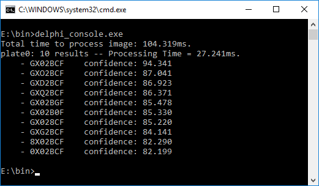
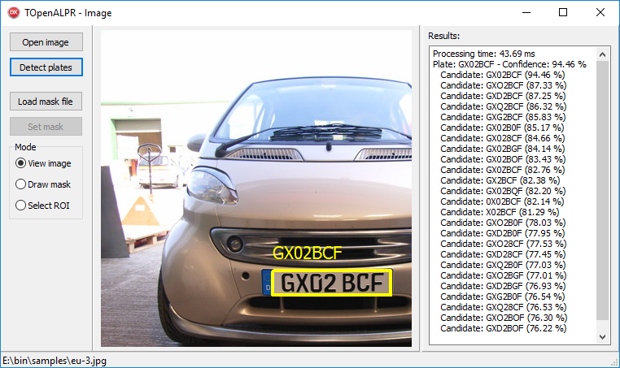
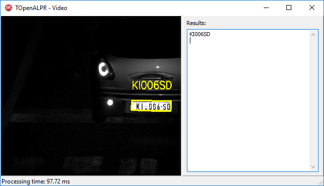

# TOpenALPR
TOpenALPR is a Delphi binding for [OpenALPR](https://github.com/openalpr/openalpr) - Automatic License Plate Recognition library.

## Building examples
All examples were tested in Delphi 10.2 Tokyo Starter (**32-bit**). *Microsoft Visual C++ 2015 Redistributable* must be installed on the computer.  
**TOpenALPR** requires build of main library that includes C binding. However latest release (2.3.0) does not export C functions, this functionality was implemented [later](https://github.com/openalpr/openalpr/commit/ae9cb421028b324c3c556d09c9bf60b703443c78).  
1. Download and unpack [OpenALPR 2.3.0](https://github.com/openalpr/openalpr/releases/download/v2.3.0/openalpr-2.3.0-win-32bit.zip). Copy files:
   - all files and sub-directories `openalpr_32\runtime_data` to `bin\runtime_data`
   - all files and sub-directories `openalpr_32\samples` to `bin\samples`
   - `openalpr_32\openalpr.conf` to `bin\openalpr.conf`
   - `openalpr_32\liblept170.dll` to `bin\liblept170.dll`
   - `openalpr_32\opencv_ffmpeg300.dll` to `bin\opencv_ffmpeg300.dll`
   - `openalpr_32\opencv_world300.dll` to `bin\opencv_world300.dll`
   - `openalpr_32` directory can now be deleted
2. Download and unpack [openalpr-master.zip](http://r1me.pl/openalpr-master.zip). Copy `openalpr.dll` to `bin\openalpr.dll`
3. Open and compile example project: 
   - `examples\delphi-console`. Detect plates in image file `samples\eu-1.jpg` and write to console output, similar to `alpr.exe` that is distributed with OpenALPR.
   
   
   - `examples\delphi-vcl-image`. Detect plates in JPG, PNG, BMP and GIF images.  
   
   Operates in three modes: 
      - View image: View input image and output with detected plates.
      - Draw detection mask: Press LMB to draw area to be detected, RMB to erase, MMB to erase whole area.
      - Select ROI (Region of Interest): Select detection region (rectangle).  
    
   - `examples\delphi-vcl-video`. Play `samples\eu-clip.mp4` and detect plates. Requires [Delphi-OpenCV](https://github.com/Laex/Delphi-OpenCV).  
   OpenCV version 3.x should be enabled in `source\OpenCV.inc` (set `{.$DEFINE DelphiOCVVersion_29}` and `{$DEFINE DelphiOCVVersion_30}`) **before** compiling this example. Otherwise executable will search for OpenCV 2.x files but they are not present in `bin` directory.
     
   
## License
TOpenAlpr is licensed under the MIT license.
For OpenALPR binaries and usage, follow the [original license](https://github.com/openalpr/openalpr#license).
